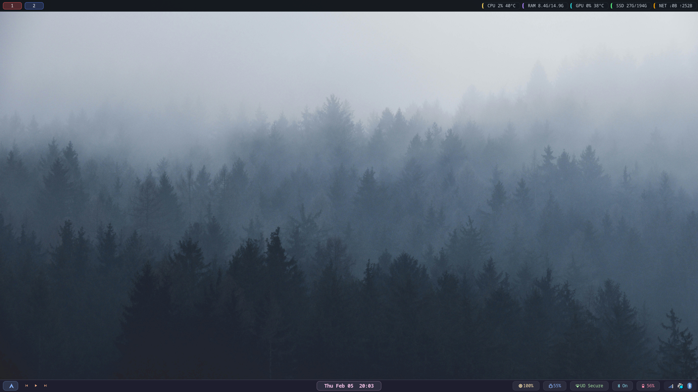
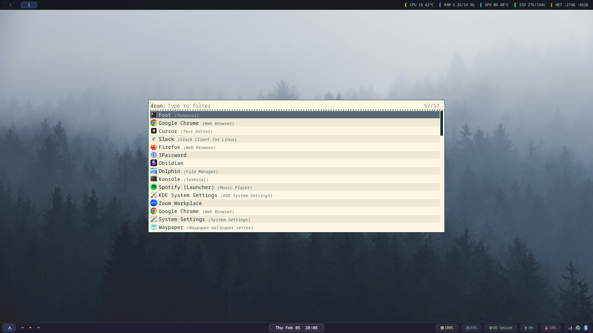

# Sway Developer Environment

A complete, reproducible Sway Wayland compositor setup with dual waybar, greetd login manager, rotating quotes, and Catppuccin theming.



## Features

- **Dual Waybar Setup**: Top bar for system monitoring, bottom bar for controls
- **Greetd Login Manager**: Terminal-based login with rotating philosophy quotes
- **Catppuccin Theming**: Consistent pastel colors throughout
- **Volume Control**: Capped at 100% with visual indicators
- **Screen Lock**: Official Catppuccin swaylock theme
- **Media Controls**: Spotify integration with playerctl
- **Auto-installer**: One-command setup

## Screenshots

### Desktop with Dual Waybar
The main desktop showing the dual waybar setup with system monitoring (top) and controls (bottom).


### App Launcher (Rofi)
Press `Super+D` to open the application launcher.



## Quick Start

```bash
git clone https://github.com/YOUR_USERNAME/sway-dev-environment.git
cd sway-dev-environment
./install.sh
```

## Prerequisites

- Arch Linux (or derivative like CachyOS, Manjaro)
- `git` installed
- sudo access

## What Gets Installed

### Core Components
- `sway` - Wayland compositor
- `waybar` - Status bar (dual instance setup)
- `greetd` + `tuigreet` - Login manager
- `swaylock-effects` - Screen locker
- `swayidle` - Idle management
- `swayosd` - On-screen display

### Applications
- `foot` - Terminal emulator
- `rofi` - Application launcher
- `mako` - Notification daemon
- `waypaper` - Wallpaper setter

### Utilities
- `brightnessctl` - Brightness control
- `wpctl` - Audio control (WirePlumber)
- `playerctl` - Media control
- `NetworkManager` - Networking
- `blueman` - Bluetooth

## Configuration Details

### Sway Keybindings

| Key | Action |
|-----|--------|
| `Super+L` | Lock screen |
| `Super+Return` | Terminal (foot) |
| `Super+D` | App launcher (rofi) |
| `Super+Shift+Q` | Kill window |
| `Fn+F2/F3` | Volume down/up |
| `Fn+F5/F6` | Brightness down/up |
| `Print` | Screenshot (full screen) |
| `Shift+Print` | Screenshot (select area) |
| `Ctrl+Print` | Screenshot (focused window) |

### Waybar Layout

**Top Bar**: Workspaces → CPU → Memory → Disk → GPU → Network Speed

**Bottom Bar**: Launcher → Media Controls → Clock → Brightness → Volume → Network → Bluetooth → Battery → Tray

### Greetd Login Screen

- Rotating quotes from philosophy, software development, and computer science
- Catppuccin color scheme
- Hotkeys: F2 (change command), F3 (change session), F12 (power menu)

## File Structure

```
.
├── install.sh              # Main installer script
├── README.md               # This file
├── config/
│   ├── sway/              # Window manager config
│   ├── waybar/            # Status bar configs
│   ├── swaylock/          # Lock screen config
│   └── greetd/            # Login manager config
└── assets/                # Screenshots, wallpapers
    ├── desktop.png        # Desktop screenshot
    └── rofi.png           # App launcher screenshot
```

## Post-Installation

1. **Set wallpaper**: Run `waypaper` and choose your wallpaper
2. **Customize quotes**: Edit `/etc/greetd/quotes.txt`
3. **Add more keybindings**: Edit `~/.config/sway/config`

## Troubleshooting

### Greetd not working
From TTY, run:
```bash
sudo systemctl stop greetd
sudo greetd --config /etc/greetd/config.toml
```

### Waybar not showing
Check logs:
```bash
waybar --config ~/.config/waybar/config-bottom -l debug
```

## Customization

### Change Login Quotes
Edit `/etc/greetd/quotes.txt` and add your own quotes (one per line)

### Change Colors
All colors use Catppuccin palette. Edit respective config files:
- Sway: `~/.config/sway/config`
- Waybar: `~/.config/waybar/style.css`
- Swaylock: `~/.config/swaylock/config`

## Credits

- [Catppuccin](https://github.com/catppuccin) - Color scheme
- [Sway](https://github.com/swaywm/sway) - Window manager
- [Waybar](https://github.com/Alexays/Waybar) - Status bar
- [Tuigreet](https://github.com/apognu/tuigreet) - Login greeter

## License

MIT - Feel free to use and modify!
